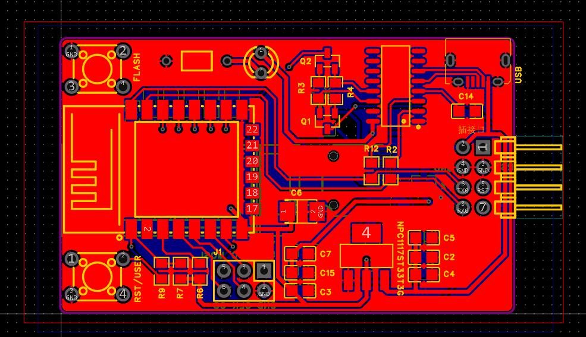

# 一、wifi模块基本原理

    此wifi模块原理就是单纯的串口转发
Wifi模块通过串口接收车辆信息，再将信息通过网络（udp协议广播）发送给上位机；wifi模块通过网络接收上位机消息，再将消息通过串口发送到车俩, 串口波特率2000000。

模块会自动尝试连接
网络名称:WifiTool
网络密码:123456789
网络频率:2.4Ghz

# 二、wifi模块原理图
    
# 三、wifi模块PCB
    
    
# 四、wifi模块电路
    